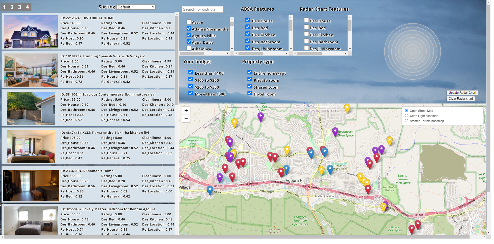

# Personalized-Airbnb-Booking-Assistant-Tool
Personalized Airbnb Booking Assistant Tool

## Survey

Please complete the survey form to provide your feedback after the test via the link:
https://forms.gle/CjgrKk8KwrdyryBh9 

## General

This tool has been developed to create a personalized search experience for Airbnb houses. The dataset used is from Inside Airbnb (http://insideairbnb.com/) website. Besides data visualization, the team used two data analytic methods for data processing:
- Aspect-based Sentiment Analysis: For text mining of descriptions and reviews of Airbnb house listings
- K-means clustering: For grouping houses with similar features based on user inputs

## How to Access the Interface
Open a python terminal and navigate to the 'Personalized-Airbnb' folder. Run command below:
- Python 2: python -m SimpleHTTPServer 8000
- Python 3: python -m http.server 8000

Where 8000 is the local host number. Then open a web browser at: http://localhost:8000/ to access the Home.html file.

Reference: [https://ryanblunden.com/create-a-http-server-with-one-command-thanks-to-python-29fcfdcd240e](https://ryanblunden.com/create-a-http-server-with-one-command-thanks-to-python-29fcfdcd240e)

## Instructions

The tool interface has four main sections:
- Sort List section on the left
- Filter section on the upper middle
- Radar Chart section on the upper right
- Map section on the lower right

### Get Start with the Filters

1. The Filter section users to input basic information for the houses. Houses filtered here will be visualized in the Map, Sort List, and the Radar Chart.

2. The search box and list below can target houses at certain districts (can use the Map section as a reference).

3. In Your budget list, users can select the houses based on price ranges.

4. In the Property type list, users can select the houses based on the property type.

5. The ABSA Features list allows users to select aspect-based sentiment analysis scores based on text mined information from Airbnb host descriptions and user reviews. There are 11 features in total (6 for the descriptions, start with Des_, and 5 for the reviews, start with Re_), each feature score stands for a level of confidence of selected features with the higher number, the better (e.g., 0.9 of Re_Bed means reviewers speakers highly of the house).

6. The Radar Chart Features list allows users to select which features will be presented on the Radar Chart map for further comparison. Note: Price, Rating, and Cleanliness have been set as default features and will always be shown on the Radar Chart.

### Sort List

1. The Sort List section shows a sample image and all the selected feature scores of houses.

2. Users can use the Sorting drop-down list to sort the houses based on Price and Rating. The top 200 houses after sorting will be presented.

3. Clicking on a single house in the Sort List will highlight it with a red bound box and locate it in the Map Section with zooming in.

4. Double-clicking a single house in the Sort List will send it to the Radar Chart for further comparison. A green message saying “House xxxxx added to RadarChart” will be popped up above Map Section accordingly.

### Map

1. The Map section shows the location of houses.

2. Different icon colors indicate house groups with similar features (based on K-means results). Users can focus on houses within specific house groups to narrow down the search scope. The default number of clusters is 4 (red, gold, blue, and violet).

3. Double-clicking a single house icon in the Map will send it to the Radar Chart for further comparison. A green message saying “House xxxxx added to RadarChart” will be popped up above Map Section accordingly.

### Radar Chart

1. The Radar Chart section allows users to conduct a detailed comparison of different house candidates.

2. Features selected in the Radar Chart Features list will be shown on the Radar Chart (plus three default features Price, Rating, and Cleanliness).

3. Double-clicking house/house icons in the Sort List Section and Map Section will add house features into Radar Chart for comparison.

4. Clicking on the Update Radar Chart button will update Radar Chart for any changing Radar Chart Features Selected.

5. Clicking on the Clear Radar Chart button will clear all previous houses added.

6. Clicking on the cross icons before each house id will turn it into a circle and hide the related house information on the Radar Chart.
